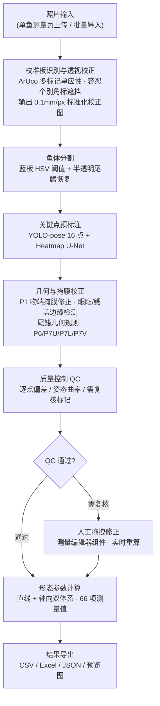
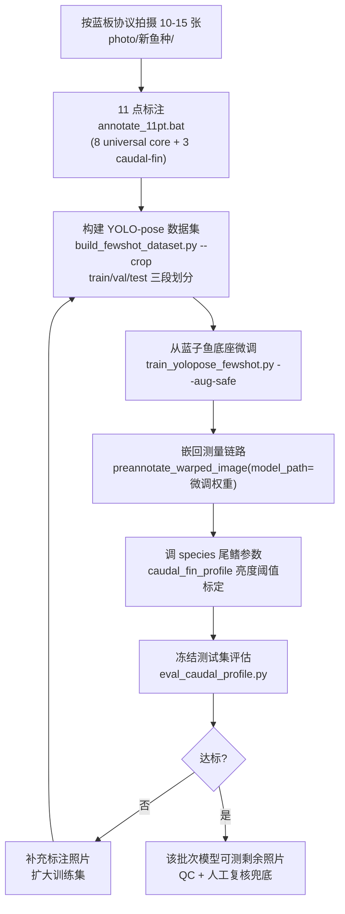

# FishMorph Local

面向**多鱼种扩展**的鱼类形态参数智能测量框架，由 `SiganusMorph Local` 稳定 V1（蓝子鱼形态参数智能测量与标注系统）迁移而来。

**内置完整实现**：蓝子鱼（Siganus）V1 species profile。
**少样本接入已验证**：海鲈、罗非鱼（各标注 10 张照片微调，体部点平均误差 4.9–6.1mm，详见 `docs/FEWSHOT_EXPERIMENT_REPORT.md`）。
鲤鱼、石斑鱼等其他鱼种可按同一流程接入，扩展规划见 `docs/MULTISPECIES_TODO.md`。

---

## 系统工作原理

从一张照片到一份形态参数报告，完整流水线如下：



关键设计：

- **半透明尾鳍处理**：尾鳍膜透出蓝板时会被"蓝色=板"规则误判，`caudal_fin_profile.recover_tail_fin` 按"蓝窗内但偏暗"重建鳍组织（参数按物种配置）；
- **尾三点不依赖关键点回归**：P6/P7U/P7L 由掩膜轮廓几何推导（右段上/下极值 + 凹陷点），关键点回归只负责体部 9 点；
- **QC 先行**：每个自动结果都带逐点复核标记，人工只处理被标记的点。

## 功能

- 图像导入与标准化单鱼侧位照片处理
- 校准板识别（ArUco / ChArUco，容忍个别角标被遮挡）与透视校正、比例尺换算
- AI 预标注：YOLO-pose + Heatmap U-Net 关键点预测（16 点体系）+ 尾鳍轮廓模块（P6/P7U/P7L 几何推导）
- 形态参数自动计算（体长、全长、体高、尾柄深等 66 项）
- 质量控制（QC）与人工拖拽复核
- 单鱼测量流程与批量测量流程
- 结果导出：CSV / Excel / 标注 JSON / 预览图

## 快速开始

```bat
run_app.bat
```

等价命令：

```bat
python -m streamlit run app.py --server.headless true --server.port 8501
```

浏览器打开 <http://localhost:8501>。

### 环境要求

- Python 3.10+（验证环境：3.10.1 / Windows 10 x64 / RTX 3050 Ti）
- 安装依赖：`pip install -r requirements.txt`
- 模型权重已随项目迁移至 `models/`（约 92MB，不入 git；缺失时从发布者处获取）
- GPU 可选：训练需要 CUDA（验证环境 torch 2.5.1+cu121），推理 CPU 亦可

### 校准板

测量前需打印校准板并随鱼拍摄，打印文件见 `data/calibration_board/`，打印说明见 `docs/board_printing_instructions.md`。

### 示例图像

`examples/siganus_example_01.png` 为一张蓝子鱼标准侧位样例，可用于上手流程。

---

## 新鱼种接入（少样本流程，约半天）

系统不内置所有鱼种。每个新鱼种只需人工标注一小批照片，即可获得该批次的专属测量模型：



### 步骤明细

| 步骤 | 命令 / 工具 | 说明 |
|---|---|---|
| 1. 拍摄 | — | 标准蓝板 + 单鱼侧位、头朝左；照片放入 `photo/<物种>/` |
| 2. 标注 | `annotate_11pt.bat` | 自动透视校正 + 预标注草案，人工点击修正；P6 可标记"不存在" |
| 3. 数据集 | `python scripts/build_fewshot_dataset.py --batch <物种> --train-n 6 --val-n 2 --test-n 2 --seed 0 --schema 16pt --crop` | 裁剪域训练；test 冻结不参与调参 |
| 4. 训练 | `python scripts/train_yolopose_fewshot.py --data <dataset>/data.yaml --base models/siganusmorph_.../preannotation_candidate.pt --epochs 150 --aug-safe` | Siganus 底座迁移；少样本安全增广 |
| 5. 嵌入 | `preannotate_warped_image(..., model_path=微调权重)` | 体部点=微调模型，尾点=caudal_fin_profile |
| 6. 评估 | `python scripts/eval_caudal_profile.py --batch <物种> --weights <best.pt> --preview` | 与零样本基线逐点对比 |

### 已验证鱼种与结果

| 鱼种 | 尾型 | 标注量 | 体部点平均误差 | 说明 |
|---|---|---|---|---|
| 蓝子鱼（Siganus） | 叉形 | V1 全量训练 | 内置 | 底座模型来源 |
| 海鲈 | 微叉形 | 10 张 | 6.1mm | 零样本 24.2mm |
| 罗非鱼 | 截形 | 6 张 | 4.9mm（零样本 8.1mm） | P6 凹陷浅，建议按 optional 处理 |

学习曲线（罗非鱼实拍，冻结测试集）：零样本 8.06mm → N=3 6.64mm → N=6 4.87mm，未饱和。
数据域说明与完整实验记录见 `docs/FEWSHOT_EXPERIMENT_REPORT.md`。

### 少样本调参要点（踩坑沉淀）

- **训练域用分割裁剪域**（`--crop`），与推理链一致；整板图训练会因分布不一致导致关键点漂移；
- **bbox padding ≥ 20%**：P1/P7U/P7L 等边界极端点若被增广推出框外，会被**静默剔除损失**（表现为体部点收敛、极端点崩溃）；
- **少样本用 `--aug-safe`**：关闭 mosaic/翻转、收窄 scale/translate；
- **底座选 Siganus 16 点权重**，不要从 COCO 底座新建小样本点头（N≤10 学不动点身份）；
- **尾鳍亮度阈值按物种标定**：在一张训练图上采样鳍组织与板面的 V 值分布取分界（海鲈 AI 图 170，罗非鱼实拍 140）。

---

## 项目结构

```text
FishMorph Local/
├── app.py                  # Streamlit 入口（首页导航）
├── pages/                  # V1 正式页面：单鱼测量 / 批量测量 / 结果导出 / 联系我们
├── siganusmorph/           # V1 核心包（迁移自原项目，暂保留原名，待二阶段重构）
│   ├── caudal_fin_profile.py   # 尾鳍轮廓模块（per-species 参数）
│   └── ...
├── config/species/         # species profile 层（当前：siganus.yaml）
├── models/                 # 运行时权重（YOLO-pose v0.3 + Heatmap U-Net v0.1/v0.5）+ 微调产物
├── assets/                 # UI 资源
├── data/calibration_board/ # 校准板打印材料
├── examples/               # 示例图像
├── photo/                  # 各鱼种照片批次（不入 git）
├── tools/annotate_11pt.py  # 11 点少样本标注工具（annotate_11pt.bat 启动）
├── scripts/                # 少样本数据集构建 / 训练 / 评估
├── tests/                  # smoke test + 回归测试 + zero-shot 试测
├── docs/                   # V1 文档 + 迁移/实验报告 + 多物种 TODO
├── requirements.txt
└── run_app.bat
```

## 配置与环境变量

| 环境变量 | 作用 |
|---|---|
| `SIGANUSMORPH_LOW_RESOURCE_MODE` | 低内存服务器模式（推理串行化） |
| `SIGANUSMORPH_RUNTIME_THREADS` | 原生库线程上限 |
| `SIGANUS_REMOTE_JOB_ROOT` | 批量任务队列存储位置（默认 `results/remote_measurement_jobs`） |
| `SIGANUSMORPH_CONTACT_NAME/ORG/EMAIL/NOTE` | "联系我们"页面信息 |

species profile（关键点体系 / 尾鳍参数 / 模型路径）逐步向 `config/species/*.yaml` 迁移，当前蓝子鱼内置、海鲈/罗非鱼参数位于 `caudal_fin_profile.py`。

## 测试

```bat
python tests/smoke_test.py          # 9 项：编译 / 导入 / 权重 / 16 点推理 / 测量 / 导出
python tests/regression_siganus.py  # 迁移保真 A/B 回归（E: 原代码 vs D: 副本）
```

## 文档

- 迁移背景与验证结果：`docs/V1_MIGRATION_REPORT.md`
- 少样本实验（海鲈 / 罗非鱼）：`docs/FEWSHOT_EXPERIMENT_REPORT.md`
- 多物种化规划：`docs/MULTISPECIES_TODO.md`
- V1 用户手册：`docs/user_manual_v1.0_draft.md`、`docs/USER_GUIDE.md`
- 16 关键点定义：`docs/keypoint_definitions.md`
- 测量轴与双轴体系：`docs/MEASUREMENT_AXIS.md`
